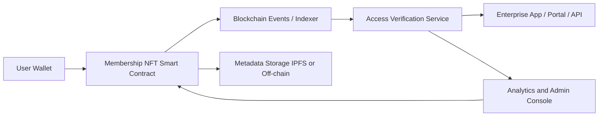

---
title: Digital Membership NFT
repo: blockchain-enterprise-blueprints
primary_keyword: NFT
secondary_keywords:
- Tokenization
- Web3
- Digital Assets
slug: digital-membership-nft
word_count_target: 1200
commit_type: 'feat(blockchain):'---

# Digital Membership NFT

## Introduction

A **Digital Membership NFT** is a membership credential issued on-chain that proves access rights, status, or eligibility for a community, product, event, or enterprise program. Unlike a simple profile badge, an NFT can be designed to carry verifiable ownership, programmable rules, and transfer constraints that make it useful for modern **Web3** membership systems.

For founders and technology leaders, the appeal is straightforward: a membership model that can be verified without a central database lookup, integrated into wallets and apps, and extended into broader **Digital Assets** strategies. When implemented well, an NFT-based membership system can support gated content, premium support, loyalty tiers, partner access, and recurring benefits.

This article explains how to design a Digital Membership NFT for enterprise use, what architecture works best, and where the operational risks are.

## Problem Statement

Traditional membership systems are usually built around centralized user tables, subscription flags, and API keys. That approach works for basic access control, but it creates several problems:

1. **Fragmented identity**  
   Membership is tied to one platform’s database, making it hard to recognize the same user across multiple apps, marketplaces, or partner ecosystems.

2. **Weak portability**  
   If a customer moves between services, the membership record does not travel with them. This limits cross-platform value and reduces the usefulness of **Tokenization**.

3. **Complex verification**  
   External partners often need to query your backend to confirm status. That adds latency, dependencies, and support overhead.

4. **Limited programmability**  
   Centralized systems can enforce access rules, but they are not naturally composable with wallets, marketplaces, and on-chain reward logic.

5. **Poor secondary market controls**  
   If membership credentials can be transferred, enterprises need explicit rules for resale, expiration, revocation, and compliance. Classic databases do not solve this elegantly.

A Digital Membership NFT addresses these issues by making membership a verifiable on-chain asset with programmable constraints. However, it must be designed carefully to avoid turning a membership program into an uncontrolled collectible.

## Solution

The solution is to treat the membership NFT as a **verifiable access token**, not just a digital collectible. The NFT should represent a specific membership entitlement with clear lifecycle rules:

- **Minting**: issue the NFT when a user purchases, earns, or receives membership.
- **Verification**: downstream systems read wallet ownership or signed proofs to grant access.
- **Renewal**: extend validity through a new token, metadata update, or subscription-linked contract logic.
- **Revocation**: disable access when membership expires, is refunded, or is invalidated.
- **Transfer policy**: decide whether the NFT is transferable, soulbound, or partially transferable.

For enterprise deployment, the best pattern is often a **hybrid model**:
- Store the canonical membership status on-chain.
- Keep sensitive customer data off-chain.
- Use signed API responses or indexed events for fast access checks.
- Connect wallet ownership to user accounts through account linking or decentralized identity flows.

This approach balances the openness of **Web3** with the operational needs of a business.

## Architecture or Framework

A practical Digital Membership NFT architecture includes five layers:

1. **Identity and wallet layer**  
   The user connects a wallet or links a wallet to an enterprise account. This can be supported by embedded wallets, custodial wallets, or external wallets depending on the audience.

2. **Membership smart contract**  
   A contract mints NFTs with metadata such as tier, expiry date, region, and benefit class. For enterprise programs, ERC-721 is common for unique memberships, while ERC-1155 can work for tiered or semi-fungible access passes.

3. **Metadata and storage layer**  
   Store non-sensitive metadata in IPFS, Arweave, or a controlled off-chain store. Sensitive fields like email, billing data, or internal customer IDs should remain off-chain.

4. **Access service layer**  
   A backend service checks wallet ownership, token validity, and business rules before granting access to apps, events, APIs, or partner systems.

5. **Analytics and operations layer**  
   Event indexing, dashboards, and alerting track mint volume, active memberships, renewal rates, and revocation events.

### Recommended framework

A robust framework for implementation:

- **Contract standard**: ERC-721 for unique premium memberships; ERC-1155 for tiered access.
- **Chain choice**: choose a low-fee chain or L2 for frequent minting and renewals.
- **Metadata schema**: include `membership_tier`, `expires_at`, `benefits_hash`, and `revocation_status`.
- **Verification method**: signed wallet challenge plus token ownership check.
- **Revocation model**: burn on expiration or maintain a revocation registry for auditability.
- **Access control**: enforce on backend rather than relying only on front-end gating.

### Example lifecycle

1. A customer buys a premium plan.
2. The system mints a Digital Membership NFT to the customer’s wallet.
3. The user signs in with their wallet to the member portal.
4. The portal checks token ownership and expiry.
5. If valid, the customer receives gated content, event access, or API entitlements.
6. When the plan ends, the token is burned or marked revoked.

This model works well when the NFT is part of a broader **Digital Assets** strategy rather than a standalone novelty.

## Benefits

A well-designed NFT membership system offers several measurable benefits:

- **Portable access**  
  Membership can be recognized across multiple properties, partner apps, and marketplaces.

- **Stronger user trust**  
  Users can verify ownership independently instead of relying entirely on a vendor database.

- **Better interoperability**  
  Wallet-based authentication integrates naturally with Web3 infrastructure, marketplaces, and token-gated communities.

- **Programmable rights**  
  Benefits can be tiered, time-limited, geographic, or event-specific.

- **Improved partner distribution**  
  Brands can issue memberships through affiliates or partners while keeping a common on-chain record.

- **Lower reconciliation effort**  
  On-chain events provide a shared source of truth for issuance and revocation.

### Business metrics to track

To know whether the program is working, monitor:

- Mint conversion rate
- Wallet connection rate
- Active membership rate
- Renewal rate
- Secondary transfer rate
- Support tickets related to access failures
- Average verification latency
- Revocation processing time

These metrics show whether the NFT model is improving user experience and operational efficiency.

## Challenges

Digital Membership NFTs also introduce real trade-offs.

### 1. Wallet UX friction
Many users are not ready to manage wallets, seed phrases, or gas fees. Embedded wallets and account abstraction can reduce friction, but they add engineering complexity.

### 2. Revocation and expiration
An NFT is durable by design, which can conflict with time-bound membership. Teams must define whether access depends on token ownership alone or on token ownership plus an expiry field checked by backend services.

### 3. Transferability risk
If membership can be transferred, users may resell access in ways that violate policy. If it cannot be transferred, the NFT behaves more like a credential than a collectible. This should be a deliberate product decision.

### 4. Privacy concerns
On-chain records are transparent. Avoid placing personal data or sensitive membership attributes directly in token metadata. Use hashes, pointers, or encrypted off-chain records instead.

### 5. Compliance and taxation
Depending on jurisdiction and utility, a membership NFT may have consumer protection, securities, or tax implications. Legal review is necessary before launch, especially when **Tokenization** resembles prepaid value or investment-like rights.

### 6. Operational support
Customers will lose access to wallets, switch devices, or need recovery. Enterprises need support workflows for wallet recovery, identity linking, and exception handling.

## Future Opportunities

Digital Membership NFTs can evolve beyond simple access passes.

### Dynamic membership tiers
Membership can update based on user activity, spending, or governance participation. A token can reflect status changes without requiring a new account model.

### Cross-brand membership networks
Multiple brands can recognize the same NFT for shared perks, event access, or loyalty benefits. This creates new distribution channels across **Web3** ecosystems.

### Programmable loyalty
Membership NFTs can combine access rights with reward accrual, referral logic, and partner discounts. That makes them useful for broader customer engagement programs.

### Decentralized identity integration
Membership can be tied to verifiable credentials, allowing stronger proof of eligibility without exposing unnecessary personal data.

### AI-assisted operations
Support teams can use AI to classify access failures, detect anomalous minting patterns, and recommend remediation steps, while the NFT remains the source of truth for ownership.

### Enterprise asset rails
As organizations expand their **Digital Assets** programs, membership NFTs can become one component of a larger tokenized stack that includes tickets, licenses, certificates, and partner entitlements.

## Conclusion

A Digital Membership NFT is most valuable when it is treated as a programmable membership credential with clear policy, not as a novelty asset. The enterprise design goal is simple: make membership portable, verifiable, and operationally manageable.

The strongest implementations combine on-chain ownership with off-chain access enforcement, careful metadata design, and explicit rules for transfer, renewal, and revocation. That hybrid architecture gives founders and CTOs the flexibility of NFT-based membership while preserving control, compliance, and supportability.

For organizations exploring **NFT**-based access programs, the next step is to define the membership lifecycle first, then choose the contract standard, wallet model, and verification flow that best fit the business.

## Related Reading

- (pending)