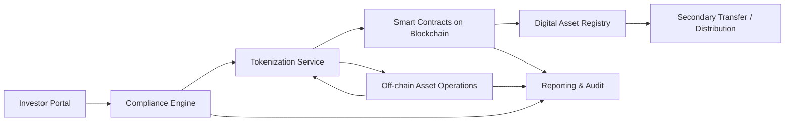

---
title: Real Estate Tokenization Architecture
repo: blockchain-enterprise-blueprints
primary_keyword: Tokenization
secondary_keywords:
- Blockchain
- Digital Assets
- Smart Contracts
slug: real-estate-tokenization-architecture
word_count_target: 1200
commit_type: 'feat(blockchain):'---

# Real Estate Tokenization Architecture

## Introduction

Real estate tokenization is the process of representing ownership, economic rights, or cash-flow participation in a property through digital tokens on a blockchain. For founders and technology leaders, the appeal is clear: tokenization can improve liquidity, reduce settlement friction, and make fractional ownership more accessible to a broader investor base.

A practical real estate tokenization architecture must do more than mint tokens. It needs to connect legal ownership structures, investor onboarding, compliance controls, valuation data, payment rails, and secondary transfer rules into one auditable system. Without that foundation, tokenized property offerings can create operational risk, regulatory exposure, and broken investor experiences.

This article outlines a production-ready architecture for real estate tokenization, with emphasis on Blockchain integration, Digital Assets lifecycle management, and Smart Contracts that enforce issuance and transfer rules.

## Problem Statement

Traditional real estate investment is constrained by high capital requirements, slow settlement, and limited liquidity. A single property investment often involves manual subscription workflows, paper-heavy agreements, custodial intermediaries, and long reconciliation cycles. These issues make it difficult to support fractional participation at scale.

There are also structural problems that tokenization must solve:

1. **Ownership complexity**: Property title is usually held by an SPV, trust, or fund vehicle rather than directly by investors.
2. **Compliance requirements**: Securities laws, KYC/AML checks, transfer restrictions, and jurisdictional limits must be enforced.
3. **Fragmented systems**: Property management, investor registry, payment processing, and blockchain records are often disconnected.
4. **Liquidity mismatch**: Investors want exit options, but real estate is inherently illiquid.
5. **Data integrity**: Valuation updates, rent distributions, and corporate actions must remain consistent across off-chain and on-chain systems.

A weak architecture can tokenize the wrong thing. Instead of digitizing real estate economics, teams may only create a token wrapper with no enforceable connection to legal rights or asset performance.

## Solution

The solution is an end-to-end tokenization platform built around a legally recognized asset structure and a controlled digital asset lifecycle.

At a high level, the architecture should:

- Place the property in a legal wrapper such as an SPV or trust.
- Issue tokenized interests that map to defined rights: equity, revenue share, or debt participation.
- Use Smart Contracts to encode issuance, transfer restrictions, and distribution logic.
- Maintain a compliance layer for investor verification and jurisdictional eligibility.
- Synchronize off-chain property operations with on-chain records.
- Provide auditability for regulators, auditors, and investors.

A strong Tokenization platform separates concerns into four layers:

- **Legal layer**: SPV formation, offering documents, investor rights, transfer restrictions.
- **Application layer**: onboarding, subscriptions, dashboards, reporting, admin workflows.
- **Blockchain layer**: minting, transfer controls, distribution contracts, token registry.
- **Data layer**: asset metadata, valuations, payments, KYC status, event logs.

The key design principle is that the blockchain should not replace legal and operational systems; it should provide a tamper-evident coordination layer for them.

## Architecture or Framework

A reference architecture for real estate tokenization can be organized into six components:

1. **Investor Portal**
   - Handles registration, identity verification, accreditation checks, and subscription.
   - Displays offerings, property performance, distributions, and transfer eligibility.
   - Integrates with KYC/AML vendors and document management systems.

2. **Compliance Engine**
   - Evaluates investor eligibility by jurisdiction, accreditation status, holding limits, and lock-up periods.
   - Exposes policy decisions to Smart Contracts through signed attestations or permissioned APIs.
   - Stores immutable compliance events for audit purposes.

3. **Tokenization Service**
   - Creates token offerings, mints Digital Assets, and manages cap table updates.
   - Links token supply to legal issuance records.
   - Supports corporate actions such as splits, redemptions, and buybacks.

4. **Blockchain Smart Contract Layer**
   - Implements token standards and transfer controls.
   - Enforces allowlists, pause mechanisms, and distribution rules.
   - Records issuance, transfer, and settlement events on-chain.

5. **Off-chain Asset Operations**
   - Manages rent collection, property maintenance, insurance, valuation feeds, and accounting.
   - Produces periodic cash-flow statements and NAV updates.
   - Reconciles real-world events with token holder entitlements.

6. **Settlement and Reporting Layer**
   - Handles fiat and stablecoin payments.
   - Generates investor tax statements, regulatory reports, and audit exports.
   - Supports secondary market integration where permitted.

A simplified flow looks like this:

### Design choices that matter

- **Permissioned vs public blockchain**:  
  A permissioned network can simplify compliance and privacy, while a public chain improves interoperability and market reach. Many enterprise teams choose a hybrid model: public settlement with permissioned transfer controls.

- **Token standard selection**:  
  For regulated assets, teams often prefer security-token-oriented standards or custom contracts with identity hooks rather than generic NFT or fungible token models. The standard should support transfer restrictions, partitioned rights, and corporate actions.

- **On-chain vs off-chain data**:  
  Token balances and transfer events belong on-chain. Sensitive identity data, legal documents, and detailed financial records should remain off-chain with hashes or references anchored on-chain.

- **Custody model**:  
  Decide whether investors self-custody, use a qualified custodian, or rely on platform-managed wallets. This choice affects user experience, compliance, and recovery procedures.

### Operational framework

A practical implementation sequence is:

1. Form the legal entity and define investor rights.
2. Build the compliance policy engine and onboarding workflow.
3. Tokenize the asset with a controlled minting contract.
4. Integrate payment distribution and reconciliation.
5. Launch reporting and audit exports.
6. Add secondary transfer workflows only after primary issuance is stable.

The architecture should also define measurable controls:
- onboarding approval time
- failed transfer rate
- distribution reconciliation accuracy
- audit log completeness
- settlement finality time

## Benefits

A well-designed tokenization architecture delivers tangible business and operational gains.

### 1. Fractional access to high-value assets
Investors can participate with smaller ticket sizes, expanding the potential market for premium properties and diversified portfolios.

### 2. Faster settlement
Blockchain-based issuance and transfer workflows reduce manual reconciliation and shorten settlement cycles compared with traditional private placement processes.

### 3. Better liquidity options
Tokenized interests can be listed on compliant secondary venues or transferred peer-to-peer where allowed, improving exit flexibility.

### 4. Transparent ownership records
On-chain records provide a clear audit trail for issuance, transfers, and distributions, which is valuable for investors, auditors, and regulators.

### 5. Programmable distributions
Smart Contracts can automate rent distributions, redemption events, and fee allocations based on predefined rules.

### 6. Lower administrative overhead
Digitized cap tables, automated compliance checks, and integrated reporting reduce manual back-office work.

For leadership teams, the strategic benefit is not just efficiency. Tokenization can create a new distribution channel for real estate products and enable product innovation around funds, revenue-share structures, and hybrid asset classes.

## Challenges

Real estate tokenization is technically and operationally demanding. The main challenges are not blockchain-specific; they are system design, legal alignment, and process control.

### Regulatory uncertainty
Tokenized real estate interests may be treated as securities in many jurisdictions. The architecture must support jurisdiction-specific restrictions, disclosures, and transfer controls. Regulatory counsel should shape the product design early.

### Legal enforceability
A token only has value if it maps to enforceable rights in the SPV, trust, or fund documents. The smart contract logic must align with legal agreements, not replace them.

### Data reconciliation
Property income, expenses, and valuations are managed off-chain, while token ownership is on-chain. Inconsistent records can lead to distribution errors or investor disputes. Strong reconciliation workflows are mandatory.

### Privacy and confidentiality
Real estate deals often involve sensitive investor and property data. Public blockchain transparency must be balanced with privacy-preserving design, such as hashed references, selective disclosure, and permissioned access controls.

### Custody and recovery
Wallet loss, key management failures, and platform access issues can create support burdens. Enterprise teams need robust custody policies, recovery flows, and role-based access controls.

### Secondary market constraints
Liquidity is often promised but not guaranteed. If the token cannot legally or operationally trade, investors may face expectations gaps. Any secondary market integration should be limited to compliant venues and approved transfer logic.

## Future Opportunities

The next phase of real estate tokenization will likely combine Blockchain infrastructure with richer financial automation and interoperability.

### Cross-asset portfolios
Investors may hold tokenized interests across office, industrial, residential, and hospitality assets in a single digital portfolio, with automated rebalancing and reporting.

### Composable finance
Tokenized property interests could be used as collateral in regulated lending, structured products, or asset-backed financing, subject to compliance controls.

### Real-time valuation and distributions
As property data pipelines mature, tokenized assets may support more frequent NAV updates and near-real-time distribution calculations.

### Interoperable identity and compliance
Reusable investor identity frameworks could reduce onboarding friction across multiple offerings while preserving jurisdictional restrictions.

### Broader digital asset ecosystems
Real estate tokenization may integrate with stablecoin payments, institutional custody, and on-chain fund administration to create a more complete Digital Assets stack.

For enterprise teams, the opportunity is to build infrastructure that can support multiple asset classes, not just a single property offering.

## Conclusion

Real estate tokenization succeeds when it is treated as a full-stack enterprise system, not a blockchain experiment. The best architecture connects legal structure, compliance, asset operations, and Smart Contracts into a controlled lifecycle that can issue, manage, and report tokenized property interests with precision.

For founders and CTOs, the core design task is to ensure that Tokenization reflects enforceable rights, compliant transfer behavior, and reliable financial operations. Blockchain provides the record of truth, but the platform must also manage the real-world mechanics of ownership, valuation, and distribution.

If you are designing a real estate tokenization platform, start with the legal wrapper, define the compliance policy engine, and then build the blockchain layer around those constraints. That sequence reduces risk and creates a system that can scale beyond a pilot.

## Related Reading

- (pending)