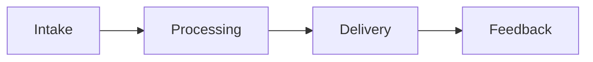

---
title: Sports Tokenization Platform
repo: blockchain-enterprise-blueprints
primary_keyword: Tokenization
secondary_keywords:
- Blockchain
- Digital Assets
- Web3
slug: sports-tokenization-platform
word_count_target: 1200
commit_type: 'feat(blockchain):'---

# Sports Tokenization Platform

## Introduction

This section covers introduction for Sports Tokenization Platform with focus on Tokenization. Organizations need clear ownership, measurable outcomes, and iterative delivery. Teams should document decisions, validate assumptions with pilots, and align Blockchain, Digital Assets, and Web3 with business goals. Teams should document decisions, validate assumptions with pilots, and align Blockchain, Digital Assets, and Web3 with business goals. Teams should document decisions, validate assumptions with pilots, and align Blockchain, Digital Assets, and Web3 with business goals. Teams should document decisions, validate assumptions with pilots, and align Blockchain, Digital Assets, and Web3 with business goals. Teams should document decisions, validate assumptions with pilots, and align Blockchain, Digital Assets, and Web3 with business goals. Teams should document decisions, validate assumptions with pilots, and align Blockchain, Digital Assets, and Web3 with business goals.  The primary focus is **Tokenization**.

## Problem Statement

This section covers problem for Sports Tokenization Platform with focus on Tokenization. Organizations need clear ownership, measurable outcomes, and iterative delivery. Teams should document decisions, validate assumptions with pilots, and align Blockchain, Digital Assets, and Web3 with business goals. Teams should document decisions, validate assumptions with pilots, and align Blockchain, Digital Assets, and Web3 with business goals. Teams should document decisions, validate assumptions with pilots, and align Blockchain, Digital Assets, and Web3 with business goals. Teams should document decisions, validate assumptions with pilots, and align Blockchain, Digital Assets, and Web3 with business goals. Teams should document decisions, validate assumptions with pilots, and align Blockchain, Digital Assets, and Web3 with business goals. 

## Solution

This section covers solution for Sports Tokenization Platform with focus on Tokenization. Organizations need clear ownership, measurable outcomes, and iterative delivery. Teams should document decisions, validate assumptions with pilots, and align Blockchain, Digital Assets, and Web3 with business goals. Teams should document decisions, validate assumptions with pilots, and align Blockchain, Digital Assets, and Web3 with business goals. Teams should document decisions, validate assumptions with pilots, and align Blockchain, Digital Assets, and Web3 with business goals. Teams should document decisions, validate assumptions with pilots, and align Blockchain, Digital Assets, and Web3 with business goals. Teams should document decisions, validate assumptions with pilots, and align Blockchain, Digital Assets, and Web3 with business goals. 

## Architecture or Framework

This section covers architecture for Sports Tokenization Platform with focus on Tokenization. Organizations need clear ownership, measurable outcomes, and iterative delivery. Teams should document decisions, validate assumptions with pilots, and align Blockchain, Digital Assets, and Web3 with business goals. Teams should document decisions, validate assumptions with pilots, and align Blockchain, Digital Assets, and Web3 with business goals. Teams should document decisions, validate assumptions with pilots, and align Blockchain, Digital Assets, and Web3 with business goals. Teams should document decisions, validate assumptions with pilots, and align Blockchain, Digital Assets, and Web3 with business goals. Teams should document decisions, validate assumptions with pilots, and align Blockchain, Digital Assets, and Web3 with business goals. Teams should document decisions, validate assumptions with pilots, and align Blockchain, Digital Assets, and Web3 with business goals. Teams should document decisions, validate assumptions with pilots, and align Blockchain, Digital Assets, and Web3 with business goals. 

## Benefits

This section covers benefits for Sports Tokenization Platform with focus on Tokenization. Organizations need clear ownership, measurable outcomes, and iterative delivery. Teams should document decisions, validate assumptions with pilots, and align Blockchain, Digital Assets, and Web3 with business goals. Teams should document decisions, validate assumptions with pilots, and align Blockchain, Digital Assets, and Web3 with business goals. Teams should document decisions, validate assumptions with pilots, and align Blockchain, Digital Assets, and Web3 with business goals. Teams should document decisions, validate assumptions with pilots, and align Blockchain, Digital Assets, and Web3 with business goals. 

## Challenges

This section covers challenges for Sports Tokenization Platform with focus on Tokenization. Organizations need clear ownership, measurable outcomes, and iterative delivery. Teams should document decisions, validate assumptions with pilots, and align Blockchain, Digital Assets, and Web3 with business goals. Teams should document decisions, validate assumptions with pilots, and align Blockchain, Digital Assets, and Web3 with business goals. Teams should document decisions, validate assumptions with pilots, and align Blockchain, Digital Assets, and Web3 with business goals. Teams should document decisions, validate assumptions with pilots, and align Blockchain, Digital Assets, and Web3 with business goals. 

## Future Opportunities

This section covers future for Sports Tokenization Platform with focus on Tokenization. Organizations need clear ownership, measurable outcomes, and iterative delivery. Teams should document decisions, validate assumptions with pilots, and align Blockchain, Digital Assets, and Web3 with business goals. Teams should document decisions, validate assumptions with pilots, and align Blockchain, Digital Assets, and Web3 with business goals. Teams should document decisions, validate assumptions with pilots, and align Blockchain, Digital Assets, and Web3 with business goals. Teams should document decisions, validate assumptions with pilots, and align Blockchain, Digital Assets, and Web3 with business goals. 

## Conclusion

This section covers conclusion for Sports Tokenization Platform with focus on Tokenization. Organizations need clear ownership, measurable outcomes, and iterative delivery. Teams should document decisions, validate assumptions with pilots, and align Blockchain, Digital Assets, and Web3 with business goals. Teams should document decisions, validate assumptions with pilots, and align Blockchain, Digital Assets, and Web3 with business goals. Teams should document decisions, validate assumptions with pilots, and align Blockchain, Digital Assets, and Web3 with business goals. Teams should document decisions, validate assumptions with pilots, and align Blockchain, Digital Assets, and Web3 with business goals. 

## Related Reading

- (pending)
