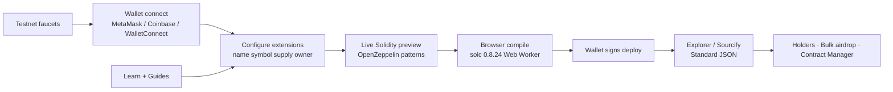

# Ethereum Toolset: A Full Developer Studio for Deploying, Building, and Shipping on Ethereum

## Introduction

Most “token creator” sites are a mint button with a logo. You click, you pay gas, and you leave — usually without understanding what you just deployed.

**Ethereum Toolset** ([ethereumtoolset.com](https://ethereumtoolset.com)) is built differently. It is a non-custodial **Ethereum** developer studio: deploy OpenZeppelin contracts from your wallet, then stay in the same product for ABI tools, holder snapshots, faucets, bulk airdrops, dashboards, and learn/guides.

The product promise is simple and accurate:

> Deploy OpenZeppelin contracts, mint NFTs, encode calldata, snapshot holders, claim testnet faucets, and learn the stack — one non-custodial studio from classroom to mainnet.

The flow is three steps: connect wallet → configure / review Solidity → sign. No signup. No custodial accounts. Keys never leave the wallet.

This article is a builder’s walkthrough of what Ethereum Toolset actually is, who it is for, and why the trust model matters if you care about shipping real **ERC-20**, NFT, and DAO systems on **Web3** without treating Solidity as a black box.

## Problem Statement

Founders, students, and operators keep hitting the same gaps:

1. **Mint buttons hide the contract.** You deploy something, but you never see the source, the extensions, or the constructor arguments that matter later.
2. **Tooling is fragmented.** One site for tokens, another for NFT metadata, another for Merkle trees, another for faucets, another for docs — and none of them share a workflow.
3. **Ops starts after deploy.** Airdrops need holder CSVs. Bulk transfers need reviewable recipient lists and downloadable reports. Most mint UIs abandon you right when the real work begins.
4. **Classrooms need testnets, not mainnet theater.** Students need Sepolia / Amoy / L2 sepolias, curated faucets, and guided paths — not a production-only form.
5. **“No-code” often means “no audit trail.”** If you cannot review Solidity before you sign, you cannot responsibly ship.

Generic token factories solve the first click. They do not solve the studio problem: deploy, verify, manage, educate, and operate in one place.

## Solution

Ethereum Toolset treats deploy as the beginning of a studio session, not the end of a form.

### Token Creator

On `/token-creator`, you deploy ERC-20s with real OpenZeppelin-style presets: Standard, Mintable, Burnable, Pausable, Permit (EIP-2612), Votes, Capped, and FlashMint. Mix extensions, set name / symbol / supply / owner / cap, review the live Solidity, compile in the browser (solc 0.8.24 in a Web Worker), deploy from your wallet, verify, and keep a local history.

### NFT Creator + Mint Asset

`/nft-creator` supports ERC721 (Standard / Royalty EIP-2981 / Votes) or ERC1155. Logos, banners, and metadata go to Irys; then you deploy and mint `#0`. `/nft-asset` mints more into an existing collection with art + metadata on Irys → `safeMint`.

Accuracy note for builders: marketing sometimes says “IPFS”; the implementation uses Irys (files under ~100 KiB can upload free).

### Contract Wizard (8 templates)

Beyond tokens and NFTs, the Contract Wizard covers Vesting, Payment Splitter, Timelock, Governor DAO, Crowdfunding, NFT Marketplace, Auction, and Staking. Configure constructor args → review OZ-based Solidity → deploy.

### Developer tools (14)

Browser utilities that belong next to deploy wizards, not in a separate bookmark folder:

- **Tokens:** Bulk Token Transfer
- **Encoding:** ABI Encoder/Decoder, Event Decoder, Calldata Decoder
- **Hashing:** Function Selector, Keccak-256, SHA-256
- **Math:** Unit Converter, CREATE2 Calculator
- **Utilities:** Address Validator, Timestamp Converter, Gas Estimator
- **Merkle:** Tree + Proof generators for airdrops and allowlists

### Bulk transfers and holder snapshots

Paste comma-separated recipients + amounts, review the list, then sign. Batch mode can send ≤50 transfers per transaction (one-time BulkTokenSender helper + approve), or one tx per row. Reports export to CSV / Excel / PDF — airdrop ops without a spreadsheet nightmare.

`/holders` rebuilds ERC-20 balances or ERC-721 owners from Transfer logs across supported chains and exports CSV / JSON / TXT for airdrops and class labs.

### Faucets, dashboard, and follow-through

`/faucets` is a curated directory (Alchemy, QuickNode, Chainlink, Paradigm MultiFaucet, thirdweb, and chain-specific Sepolia/Amoy/Base links) for classroom and staging work.

`/dashboard` is a wallet-gated workspace: token/NFT balances, watched contracts, deployment history, and jumps into bulk transfer / creators. Contract Manager lets you read/write contracts you deployed through the studio using local ABI history.

### Learn + Guides

Education is not a separate blog you forget about. Fifteen Learn articles (Beginner → Advanced) cover wallets, gas/MEV, Etherscan, ERC standards, approvals, events, proxies, reentrancy, ERC-4337, and more. Seven Guides walk launch paths: ERC-20 in minutes, NFT + metadata, Governor DAO, staking, reentrancy checklist, Etherscan verify, and OpenZeppelin Skills locally.

There is also an OpenZeppelin Skills bridge for an agent-era workflow: draft in Ethereum Toolset → refine with OZ Skills in Claude Code / Skills CLI.

## Architecture or Framework

The trust architecture is the product:

**Audited by design:** templates generate from OpenZeppelin sources (v5 / Contracts patterns).  
**See the code:** live Solidity preview before you sign.  
**Compile in browser:** no backend holding your source.  
**Non-custodial:** wallet signs deploy, Irys uploads, and transfers.  
**Verify after ship:** explorer / Sourcify path with Standard JSON.  
**Education colocated:** Learn + Guides open into the same wizards.  
**Free to use:** software marked price 0 — donate optionally in ETH/USDC if you want to support the builder.

Scale that is real today:

- **8** contract templates
- **14** developer tools
- **15** learn articles · **7** guides
- **35** networks (17 mainnets + 18 testnets), including Ethereum, Polygon, Arbitrum, Optimism, Base, Avalanche, BNB, Linea, Scroll, Blast, zkSync, Gnosis, Mantle, Celo, Mode, Ink, Polygon zkEVM — plus Sepolia, Holesky, Hoodi, Amoy, and matching L2 sepolias

Wallets: MetaMask/injected, Coinbase Wallet, and WalletConnect when configured.

Ethereum Toolset sits in a multi-chain family with SolanaToolset and BNBToolset — same studio philosophy across ecosystems.

## Benefits

**For founders:** ship a real ERC-20 / NFT / DAO without writing Solidity first, while still reviewing bytecode and constructor intent before signing.

**For students and classrooms:** faucet → testnet token → verified contract in one app, without juggling five browser tabs.

**For developers:** ABI, Merkle, CREATE2, and unit tools live next to the deploy wizards you already use.

**For operators:** holders export + bulk multi-send + downloadable reports turn “we minted a token” into “we can run an airdrop.”

**For trust:** OpenZeppelin patterns, client-side compile, wallet-signed deploys, and verification paths beat opaque mint factories.

**For velocity:** zero signup friction. Open the studio, connect a wallet, ship.

## Challenges

A studio like this still has honest limits — and naming them builds more credibility than hiding them:

- Deployments and ABI history live in **browser localStorage**, not a hosted SaaS account system.
- NFT storage is **Irys**, not a classic IPFS pinning UI.
- The gas estimator is a **rough calculator**, not a live oracle.
- Bulk transfer deploys a **helper contract** on first batch use per chain.
- More automation can tempt people to skip review — the Solidity preview exists so you do not.

Those are product constraints, not marketing footnotes. The studio is free and non-custodial because it refuses to become a custodian of your keys or your source.

## Future Opportunities

The next chapter of Ethereum developer tooling is agentic: draft contracts in a studio, refine with OpenZeppelin Skills in Claude Code / Skills CLI, then verify and operate with the same wallet-owned history.

Wider EVM coverage, deeper classroom paths (faucet → Sepolia → verified contract), and tighter airdrop ops (holders CSV → Merkle proofs → bulk transfer reports) are natural extensions of a studio that already refuses to be “just a mint button.”

If you are building across chains, the sibling toolsets (Solana / BNB) point at the same idea: one coherent place to learn, deploy, and ship — without surrendering custody.

## Conclusion

Ethereum Toolset is for people who want a real studio: OpenZeppelin contracts you can see, browser compile you can trust, wallet signatures you control, and ops/education that continue after the deploy toast disappears.

Start at [ethereumtoolset.com](https://ethereumtoolset.com) — connect a wallet, review the Solidity, and ship from classroom testnets to mainnet when you are ready.

**Tagline:** *The Ethereum developer studio — deploy, build, and ship.*  
**Handle:** [@EthereumToolset](https://ethereumtoolset.com)

## About the Builder

**Muhammad Ibrahim (Ibrahim Wali)** — Founder & CEO · Technology Architect · AI and Blockchain Builder.

Building technologies that empower businesses, communities, and future digital economies.

*Building Today. Legacy Forever.*

Ibrahim is the builder behind Ethereum Toolset, and also behind SolanaToolset and BNBToolset. His public knowledge libraries include:

| Library | Focus |
|---------|--------|
| [ai-business-playbooks](https://github.com/Mibrahimwali/ai-business-playbooks) | Enterprise AI, agents, RAG, automation |
| [blockchain-enterprise-blueprints](https://github.com/Mibrahimwali/blockchain-enterprise-blueprints) | Tokenization, Web3, digital assets |
| [founder-operating-system](https://github.com/Mibrahimwali/founder-operating-system) | Leadership, hiring, fundraising, scaling |
| [future-of-ai-and-web3](https://github.com/Mibrahimwali/future-of-ai-and-web3) | Decentralized AI, agent economies, research |
| [1000-startup-ideas](https://github.com/Mibrahimwali/1000-startup-ideas) | Startup opportunities across industries |
| [system-design-for-founders](https://github.com/Mibrahimwali/system-design-for-founders) | Architecture, cloud, scalability |

Product: [ethereumtoolset.com](https://ethereumtoolset.com)

## Related Reading

- (pending)
