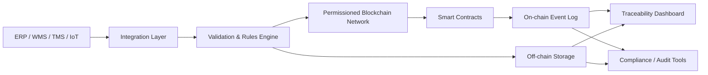

---
title: Supply Chain Tracking on Blockchain
repo: blockchain-enterprise-blueprints
primary_keyword: Blockchain
secondary_keywords:
- Supply Chain
- Enterprise Blockchain
- Web3
slug: supply-chain-tracking-on-blockchain
word_count_target: 1200
commit_type: 'feat(blockchain):'---

# Supply Chain Tracking on Blockchain

## Introduction

**Blockchain** is increasingly used to improve traceability, auditability, and trust across multi-party logistics networks. For founders, CTOs, and operations leaders, the main appeal is not hype: it is the ability to create a shared, tamper-evident record of product movement, handoffs, inspections, and certifications across suppliers, manufacturers, carriers, distributors, and retailers.

In a modern **Supply Chain**, data fragmentation is the default. Each organization runs its own ERP, WMS, TMS, or quality system. That creates inconsistent timestamps, manual reconciliation, and limited visibility when something goes wrong. A well-designed **Enterprise Blockchain** network can reduce these issues by anchoring key events on-chain while keeping sensitive operational data off-chain.

This article explains how to build supply chain tracking on blockchain, what architecture works in enterprise settings, and where the practical trade-offs appear.

## Problem Statement

Traditional supply chain tracking relies on centralized databases and document exchange. That model breaks down when multiple companies need to agree on the same history of an asset.

Common failure points include:

- **Data silos:** Each participant maintains separate records, so disputes require manual reconciliation.
- **Poor provenance:** It is hard to prove where a shipment came from, who handled it, and under what conditions.
- **Counterfeit risk:** High-value goods, pharmaceuticals, luxury items, and spare parts can be substituted or tampered with.
- **Audit overhead:** Compliance teams spend time collecting PDFs, emails, and spreadsheet exports.
- **Delayed exception handling:** If a temperature excursion or customs delay occurs, downstream parties learn too late.

For enterprise leaders, the core issue is trust between organizations that do not share a single system of record. **Blockchain** is useful here because it provides a shared ledger where events can be written once and verified by all authorized parties. However, the design must reflect real operational constraints: privacy, throughput, integration, and governance.

## Solution

The most effective approach is to track supply chain events as immutable ledger entries tied to a digital asset identity. Each physical item, batch, pallet, or shipment gets a unique on-chain identifier. Events such as creation, packing, transfer, inspection, receipt, and exception handling are recorded as signed transactions.

A practical implementation follows these principles:

1. **Represent assets consistently**
   - Assign a unique token or asset record to each trackable unit.
   - Use batch-level tracking for commodities and item-level tracking for high-value goods.
   - Store only essential identifiers on-chain.

2. **Record lifecycle events**
   - Manufacturing completion
   - Warehouse receipt
   - Carrier pickup
   - Customs clearance
   - Temperature or location checkpoint
   - Delivery confirmation
   - Recall or quarantine event

3. **Separate public proof from private data**
   - Store hashes, event IDs, and ownership transitions on-chain.
   - Keep invoices, certificates, sensor payloads, and partner-specific data in off-chain systems.
   - Use encrypted object storage or enterprise data platforms for large payloads.

4. **Use digital signatures**
   - Each partner signs events with its own key.
   - Signatures provide non-repudiation and support dispute resolution.

5. **Integrate with existing systems**
   - ERP systems publish events through APIs or message queues.
   - IoT devices send sensor telemetry to an ingestion layer.
   - A blockchain adapter writes validated events to the ledger.

For many organizations, the best use case is not tracking every byte of supply chain data on-chain. It is creating a trusted audit trail that can be independently verified by all participants.

## Architecture or Framework

A robust **Enterprise Blockchain** architecture for supply chain tracking usually has five layers:

- **Source systems:** ERP, WMS, TMS, MES, IoT sensors, quality systems
- **Integration layer:** API gateway, event bus, ETL/ELT pipelines, validation services
- **Blockchain layer:** permissioned network, smart contracts, consensus, identity management
- **Off-chain storage:** document store, data lake, encrypted file storage, analytics warehouse
- **Application layer:** supplier portal, traceability dashboard, compliance console, recall workflow

### Recommended framework

For enterprise deployments, a permissioned network is usually the right starting point. Options include:

- **Hyperledger Fabric** for modular identity, private channels, and high control over access
- **Quorum / Besu** for Ethereum-compatible smart contracts and enterprise deployment patterns
- **Corda** when the workflow is heavily bilateral and privacy is paramount

A typical smart contract model includes:

- `AssetRegistry` for creating and linking product identities
- `TransferContract` for ownership or custody changes
- `InspectionContract` for quality and compliance events
- `ExceptionContract` for recalls, damage, or temperature violations

### Data model example

Each event should include:

- `asset_id`
- `event_type`
- `timestamp`
- `actor_id`
- `location_code`
- `reference_hash`
- `previous_event_hash`
- `signature`

This structure creates a chain of custody that is easy to verify. If one record is altered, the hash chain breaks.

### Governance model

A supply chain network is not just software; it is a consortium. Define:

- onboarding and offboarding rules
- identity issuance and revocation
- data retention policies
- dispute resolution procedures
- node hosting responsibilities
- SLA targets for transaction confirmation and uptime

Without governance, even the best **Blockchain** architecture becomes an underused pilot.

## Benefits

When implemented correctly, supply chain tracking on blockchain delivers measurable outcomes.

### 1. Improved provenance
Teams can trace a product from origin to delivery with a consistent event history. This is valuable for pharmaceuticals, food, electronics, and luxury goods.

### 2. Faster audits
Auditors can verify signed records instead of collecting evidence from multiple systems. This reduces manual document handling and shortens audit cycles.

### 3. Better recall execution
If a defect is discovered, the company can identify affected batches faster and notify downstream parties with fewer errors.

### 4. Reduced dispute costs
Shared timestamps and signed custody transfers make it easier to resolve claims about damage, delay, or missing goods.

### 5. Stronger partner collaboration
A shared ledger improves coordination among suppliers, logistics providers, and retailers without forcing one party to own the master database.

### 6. Web3-ready extensibility
The same asset identity model can support tokenization, warranty lifecycle management, and digital product passports. That makes future **Web3** integrations easier without redesigning the core traceability layer.

From a metrics perspective, leaders should track:

- percentage of shipments with complete event history
- time to trace a batch end-to-end
- audit preparation hours
- recall identification time
- exception resolution time
- partner adoption rate

## Challenges

Supply chain blockchain projects fail when teams underestimate operational complexity.

### Privacy and commercial sensitivity
Partners may not want pricing, volumes, or customer relationships exposed, even to consortium members. Use permissioned access, selective disclosure, and off-chain encrypted storage.

### Data quality at the source
Blockchain preserves records, but it does not guarantee that records are correct. If a warehouse scans the wrong pallet or a sensor is miscalibrated, the ledger will faithfully preserve bad data. Validation rules and device attestation are essential.

### Integration burden
Legacy ERP and logistics systems are often brittle. Building reliable adapters, event mappings, and error handling takes time and cross-functional ownership.

### Throughput and latency
High-volume networks can generate thousands of events per hour. Design for batching, asynchronous writes, and clear confirmation rules. Do not force every telemetry reading onto the ledger.

### Consortium governance
Different organizations have different incentives. One partner may want more transparency while another wants more privacy. The governance charter must be agreed before development begins.

### Regulatory alignment
Industries such as food, pharmaceuticals, and cross-border logistics have strict compliance requirements. The architecture must support retention, auditability, and jurisdiction-aware data handling.

The strongest **Supply Chain** programs treat blockchain as a coordination layer, not a replacement for operational systems.

## Future Opportunities

The next phase of supply chain blockchain will combine traceability with richer digital asset infrastructure.

### Digital product passports
Manufacturers can attach lifecycle, repair, and sustainability data to each item. This supports circular economy initiatives and regulatory reporting.

### Tokenized inventory and financing
When a shipment is represented as a verifiable digital asset, it can support trade finance, collateralization, and automated release conditions.

### IoT-driven exception automation
Sensor feeds can trigger smart contract events for temperature excursions, route deviations, or seal breaches. This enables faster intervention.

### Interoperable Web3 infrastructure
As standards mature, enterprise networks may connect to broader **Web3** systems for cross-chain verification, supplier credentials, and portable product identities.

### AI-assisted traceability
Analytics and anomaly detection can sit on top of the ledger to identify suspicious patterns, predict delays, and prioritize investigations.

For leaders planning a roadmap, the best strategy is to start with a narrow, high-value use case such as cold-chain pharmaceuticals or premium goods, prove traceability metrics, and then expand to adjacent workflows.

## Conclusion

Supply chain tracking on blockchain is most valuable when it solves a specific trust problem between organizations. The winning pattern is a permissioned ledger, signed event model, off-chain document storage, and strong governance. That combination creates a durable chain of custody without forcing every operational detail onto the chain.

For founders and CTOs, the key decision is not whether **Blockchain** is interesting. It is whether the business has a multi-party trust problem that cannot be solved cleanly with a single centralized system. If the answer is yes, then a well-architected traceability network can reduce disputes, improve compliance, and create a foundation for future digital asset and **Enterprise Blockchain** initiatives.

## Related Reading

- (pending)