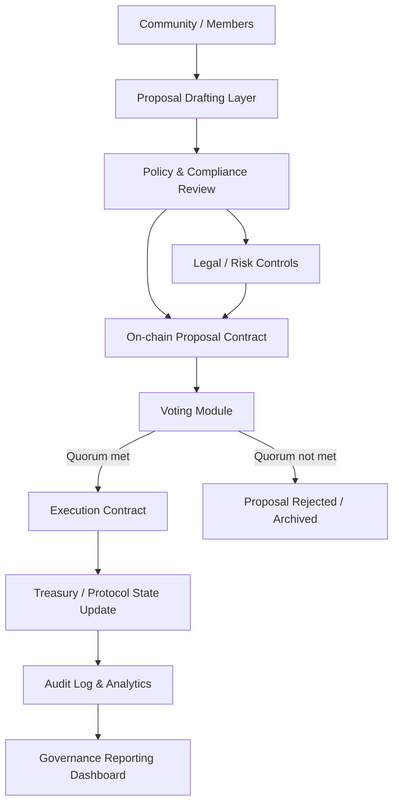

---
title: DAO Governance Framework
repo: blockchain-enterprise-blueprints
primary_keyword: DAO Models
secondary_keywords:
- Web3
- Smart Contracts
- Blockchain
slug: dao-governance-framework
word_count_target: 1200
commit_type: 'feat(blockchain):'---

# DAO Governance Framework

## Introduction

DAO Models are becoming a practical way for organizations to coordinate capital, decisions, and incentives without relying on a traditional board-centric operating model. For enterprise teams exploring Web3 initiatives, a DAO governance framework defines how proposals are created, reviewed, voted on, executed, and audited. It is not just about token voting; it is about designing decision rights, accountability, and operational controls that can survive real-world scale.

For founders and CTOs, the key question is not whether a DAO can vote, but whether the governance process can support treasury management, protocol upgrades, contributor allocation, and compliance requirements. A strong framework combines policy, smart contracts, and off-chain operations into one coherent system.

## Problem Statement

Many organizations adopt DAO Models with a narrow focus on token-based voting and overlook the governance mechanics needed for enterprise use. This creates several failures:

1. **Low participation and voter apathy**: If only a small share of token holders vote, decisions may not reflect the broader community.
2. **Governance capture**: Large holders, insiders, or delegated voting blocs can dominate outcomes.
3. **Weak execution guarantees**: A proposal may pass, but implementation still depends on manual coordination.
4. **Compliance and audit gaps**: Enterprises need traceability for approvals, treasury actions, and policy enforcement.
5. **Poor separation of concerns**: Governance, execution, and identity are often mixed together, making systems brittle.

In practice, a DAO governance framework must address both social and technical risks. Without explicit rules, a DAO can become either too centralized to be credible or too decentralized to operate efficiently.

## Solution

A robust DAO governance framework should define five layers:

- **Membership and identity**: Who can propose, vote, delegate, or execute?
- **Proposal lifecycle**: How are ideas drafted, discussed, reviewed, and finalized?
- **Voting mechanics**: What voting method is used, and what quorum or thresholds apply?
- **Execution layer**: How are approved decisions turned into on-chain actions?
- **Monitoring and auditability**: How are decisions recorded, measured, and reviewed?

For enterprise-grade DAO Models, a hybrid governance approach is usually best. That means combining on-chain Smart Contracts for deterministic actions with off-chain processes for discussion, legal review, and compliance checks. This reduces risk while preserving transparency.

A practical implementation pattern is:

1. **Draft proposal off-chain** in a governance forum or structured template.
2. **Pre-screen proposal** for policy, budget, and legal constraints.
3. **Submit on-chain proposal** with metadata, execution payload, and voting window.
4. **Vote using defined rules** such as token-weighted voting, quadratic voting, or delegated voting.
5. **Execute automatically** through Smart Contracts if thresholds are met.
6. **Log and audit outcomes** for treasury, compliance, and performance reporting.

This model works well for tokenization platforms, NFT communities, digital asset consortia, and protocol governance programs.

## Architecture or Framework

A DAO governance framework should be designed as a layered architecture with clear trust boundaries.

### 1. Identity and participation layer
This layer determines who can interact with governance. Options include:
- Wallet-based membership
- NFT-gated access
- Allowlisted enterprise identities
- Delegated voting rights

For enterprises, identity should often be linked to a real-world role or verified credential, not just a wallet address. This helps prevent sybil attacks and supports accountability.

### 2. Proposal contract layer
The proposal contract stores:
- Proposal ID
- Metadata URI
- Voting start and end times
- Execution payload
- Quorum and threshold rules

A clean contract design should separate proposal storage from execution logic. That makes upgrades safer and reduces the chance that a governance bug can break the entire system.

### 3. Voting module
DAO Models may use different voting systems depending on the objective:
- **Token-weighted voting**: Simple and common, but vulnerable to whale dominance.
- **Quadratic voting**: Better for preference intensity, but more complex.
- **Delegated voting**: Increases participation by allowing representation.
- **Role-based voting**: Useful for enterprise governance where roles matter more than token balance.

A good framework may combine these methods. For example, strategic treasury decisions can require role-based approval plus token-holder ratification.

### 4. Execution and controls
Execution should be deterministic whenever possible. Smart Contracts can:
- Transfer treasury funds
- Change protocol parameters
- Whitelist assets
- Mint or burn governance tokens
- Update NFT metadata rules or access policies

For higher-risk actions, use a timelock contract so stakeholders can review the outcome before execution. This is especially important in Blockchain environments where irreversible actions can create material losses.

### 5. Analytics and auditability
Governance needs metrics, not just votes. Track:
- Proposal participation rate
- Quorum attainment rate
- Vote concentration index
- Median time from proposal to execution
- Percentage of proposals executed without manual intervention
- Treasury actions approved vs. rejected

These metrics help leadership identify whether governance is healthy or drifting toward centralization.

## Benefits

A well-designed DAO governance framework offers several enterprise advantages.

### Transparent decision-making
Every proposal, vote, and execution can be traced. This improves trust among stakeholders and reduces disputes over who approved what.

### Faster coordination
Compared with traditional committee cycles, DAO Models can shorten approval times. With clear rules and automated execution, routine actions move faster and with fewer manual handoffs.

### Better treasury control
Smart Contracts can enforce spending limits, timelocks, and multi-signature approvals. This is valuable for digital asset treasuries, grants, and ecosystem funds.

### Improved stakeholder alignment
Token holders, contributors, and partners can participate according to defined rights. This makes incentives more visible and can improve long-term engagement.

### Programmable governance
Rules can be encoded into Blockchain infrastructure. That means governance can evolve from a policy document into an operational system with measurable controls.

## Challenges

DAO governance is powerful, but it introduces difficult trade-offs.

### Governance capture
If voting power is concentrated, the system may appear decentralized while being controlled by a few actors. Mitigations include delegation caps, quorum thresholds, and reputation-weighted safeguards.

### Low-quality participation
Many voters do not have time to analyze proposals. This can lead to superficial decision-making. Better proposal templates, summaries, and expert review layers can improve signal quality.

### Regulatory uncertainty
Enterprises must consider securities law, tax treatment, fiduciary duties, and jurisdiction-specific compliance. A DAO governance framework should include legal review gates before on-chain execution.

### Smart contract risk
Bugs in Smart Contracts can create irreversible failures. Formal audits, test coverage, and timelock mechanisms are essential, especially for treasury and protocol upgrade contracts.

### Coordination overhead
If governance becomes too complex, participation drops. The framework must balance rigor with usability. Too many voting layers can slow the organization more than a traditional process would.

## Future Opportunities

DAO governance is still evolving, and several developments will improve enterprise adoption.

### Reputation-based governance
Future DAO Models will likely combine token ownership with reputation, contribution history, and domain expertise. This can reduce whale dominance and improve decision quality.

### AI-assisted proposal analysis
Governance platforms can use AI to summarize proposals, detect inconsistencies, estimate financial impact, and flag compliance risks. The human decision remains central, but review becomes faster and more structured.

### Cross-chain governance
As organizations operate across multiple Blockchain networks, governance will need to control assets and policies across chains. Cross-chain execution and message passing will become a standard requirement.

### Compliance-aware automation
Smart Contracts can incorporate policy rules such as spending caps, regional restrictions, and approval tiers. This will make DAO governance more suitable for regulated industries.

### Modular governance stacks
Instead of one monolithic DAO system, organizations will adopt modular components for identity, voting, treasury, and analytics. This makes governance easier to upgrade and adapt.

## Conclusion

A DAO governance framework is more than a voting mechanism. For enterprise use, it is a complete operating model that defines who participates, how decisions are made, how Smart Contracts execute those decisions, and how the organization proves accountability over time.

The strongest DAO Models are hybrid: transparent on-chain execution paired with off-chain policy review, identity controls, and audit reporting. That balance helps organizations move beyond experimental governance and toward reliable coordination for tokenization, NFTs, digital assets, and broader Web3 infrastructure.

If you are designing governance for an enterprise blockchain initiative, start with decision rights, not code. Then encode those rules into contracts, measure the outcomes, and iterate based on participation, execution quality, and risk exposure.

## Related Reading

- (pending)