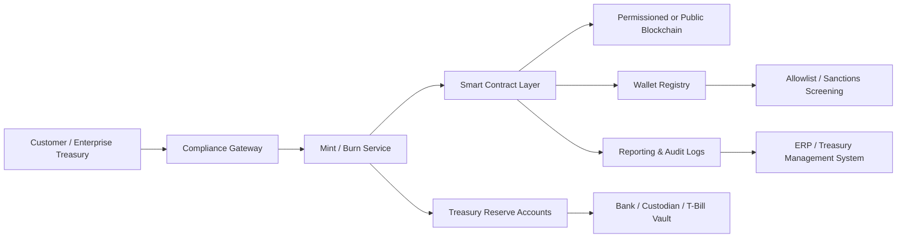

---
title: Enterprise Stablecoin Design
repo: blockchain-enterprise-blueprints
primary_keyword: Stablecoins
secondary_keywords:
- Blockchain
- Digital Assets
- Enterprise Blockchain
slug: enterprise-stablecoin-design
word_count_target: 1200
commit_type: 'feat(blockchain):'---

# Enterprise Stablecoin Design

## Introduction

**Stablecoins** are becoming a core building block for enterprise **Blockchain** systems that need programmable money, faster settlement, and lower cross-border transfer costs. For founders, CTOs, and technology leaders, the design challenge is not simply “how do we issue a token?” but “how do we build a stable digital asset that can survive treasury scrutiny, compliance review, and production-scale operations?”

Enterprise **Digital Assets** differ from retail crypto products in one important way: the operating model must be as robust as the payment rail itself. That means clear reserve policies, predictable redemption mechanics, auditability, sanctions controls, and integration with existing finance and risk systems. When implemented correctly, **Stablecoins** can support treasury operations, supplier payouts, internal settlement, and on-chain cash management without introducing unnecessary volatility.

## Problem Statement

Traditional enterprise payment systems are fragmented. Bank wires are slow, card networks are expensive for certain flows, and cross-border settlement often introduces delays, foreign exchange friction, and reconciliation overhead. Even when a company uses multiple banking partners, each rail has different operating hours, cutoffs, and exception handling.

The common enterprise goals for **Stablecoins** include:

- Near-instant settlement between business entities
- 24/7 transferability across regions
- Reduced dependency on intermediaries for internal and partner settlement
- Better programmability for escrow, conditional release, and automated payout logic
- Improved transparency for treasury and operations teams

However, enterprises face a different set of risks than consumer crypto projects. A stablecoin failure can create balance sheet exposure, legal liability, or reputational damage. The main problem areas are:

1. **Reserve integrity**: Is every token fully backed, and by what assets?
2. **Redemption certainty**: Can holders redeem at par within a defined SLA?
3. **Compliance**: Can the system enforce KYC, sanctions screening, and jurisdictional controls?
4. **Operational resilience**: What happens during chain congestion, oracle failure, or banking outages?
5. **Accounting treatment**: How are liabilities, reserves, and token circulation represented in financial systems?

Without a disciplined architecture, a stablecoin becomes a liability generator instead of a payment instrument.

## Solution

An enterprise stablecoin should be designed as a regulated financial product with software-defined controls. The best pattern is to separate the system into four layers:

- **Issuance layer**: mints tokens only after approved funding is confirmed
- **Reserve layer**: holds cash, T-bills, or approved collateral under treasury policy
- **Compliance layer**: enforces allowlists, sanctions checks, and transfer restrictions
- **Settlement layer**: moves tokens across approved wallets and business workflows

For most enterprises, the safest design is a **fully reserved fiat-backed model**. Each token represents a claim on a segregated reserve pool, typically held in cash or cash equivalents. This model is easier to explain to auditors and regulators than algorithmic or undercollateralized alternatives.

A practical enterprise implementation should define:

- **Minting rules**: only after cleared funds are received
- **Burning rules**: only when redemption requests are settled
- **Transfer policy**: only approved wallets and counterparties
- **Freeze authority**: tightly governed, with dual control and audit logs
- **Reporting**: daily circulation, reserve composition, and exception reports

For enterprise use cases, the stablecoin should also support:

- **Atomic settlement** for delivery-versus-payment workflows
- **Programmable escrow** for supplier or marketplace payouts
- **Multi-entity treasury** for subsidiaries and regional operations
- **API-first integration** with ERP, treasury management systems, and reconciliation tools

## Architecture or Framework

A reference architecture for **Stablecoins** in an **Enterprise Blockchain** environment can be organized as follows:

### 1. Compliance Gateway
This is the first control point. It performs identity verification, sanctions screening, wallet risk scoring, and jurisdiction checks before any mint, transfer, or redemption request is accepted. For enterprise deployments, this layer should integrate with existing KYC/KYB providers and internal policy engines.

### 2. Mint and Burn Service
The mint/burn service is the operational bridge between fiat reserves and token supply. It should use idempotent APIs, clear state transitions, and event-driven processing. A typical flow is:

1. Deposit received in reserve account
2. Treasury confirms settlement finality
3. Compliance gateway approves the request
4. Mint service issues tokens to the approved wallet
5. Ledger and reporting systems record the event

Burning should follow the reverse sequence and require redemption approval, liquidity confirmation, and accounting entry generation.

### 3. Smart Contract Layer
The token contract should be intentionally simple. Core functions usually include:

- `mint(address to, uint256 amount)`
- `burn(address from, uint256 amount)`
- `pause()` and `unpause()`
- `freeze(address wallet)` if legally required
- `transfer()` with allowlist validation

Avoid embedding complex business logic directly into the token contract. Instead, keep policy in external services so that rules can evolve without risky contract rewrites.

### 4. Reserve and Custody Model
The reserve structure should match the product promise. If the token is marketed as fully reserved, the reserve account structure must support daily reconciliation and clear asset segregation. Many enterprises use a mix of:

- Cash at insured banks
- Short-duration U.S. Treasury instruments
- Qualified custodial accounts

Treasury policy should define duration limits, concentration limits, counterparty exposure, and liquidation procedures. If reserves include yield-bearing assets, the enterprise must also define who receives the yield and how that affects token economics.

### 5. Audit and Reporting
Enterprise-grade **Digital Assets** require evidence. Every mint, burn, freeze, and transfer restriction should produce immutable logs, signed events, and reconciliation outputs. Finance teams need daily proofs of:

- Circulating supply
- Reserve balances
- Outstanding redemptions
- Exceptions and manual overrides

## Benefits

When designed correctly, **Stablecoins** can create measurable enterprise value.

### Faster settlement
Transactions can settle in seconds or minutes instead of days. For treasury teams, this reduces trapped working capital and improves liquidity planning.

### Lower operational friction
A single token rail can reduce dependence on multiple bank integrations, especially for internal transfers and partner payouts. This is particularly valuable in **Blockchain**-enabled ecosystems with many counterparties.

### Better reconciliation
Because token movement is event-driven and timestamped, reconciliation can be more deterministic than with traditional payment files. Finance teams can match on-chain movement with reserve movements and ERP entries.

### Programmable controls
Enterprises can encode approval workflows, escrow conditions, threshold-based release, and wallet restrictions. This is especially useful for marketplaces, supply chain finance, and intercompany settlement.

### Global reach
A stable token can support 24/7 operations across regions, reducing the impact of banking holidays and time-zone boundaries.

## Challenges

Enterprise stablecoin design is not primarily a token engineering problem; it is a governance and risk problem.

### Regulatory complexity
Stablecoin activity can touch money transmission, securities, payments, and custody rules depending on jurisdiction. Legal review must happen before product launch, not after.

### Reserve risk
If reserves are not liquid, segregated, and auditable, redemption confidence will erode quickly. Even minor reserve mismatches can create a systemic trust issue.

### Smart contract risk
Token contracts are permanent infrastructure. A bug in minting, freezing, or access control can have severe consequences. Independent audits, formal reviews, and limited contract scope are essential.

### Operational dependency on external systems
Banking APIs, custodians, compliance vendors, and blockchain nodes all become part of the critical path. Each dependency needs SLAs, fallback procedures, and incident response plans.

### Governance tension
Enterprises want control, but token holders need predictability. Too much admin power undermines trust; too little makes risk containment difficult. The answer is transparent governance with multi-signature approvals, role separation, and policy logs.

## Future Opportunities

The next phase of **Stablecoins** in enterprise infrastructure will likely move beyond simple payments.

### Tokenized treasury operations
Enterprises can use stable tokens as a bridge between cash management and on-chain finance, enabling instant movement between operating entities and investment instruments.

### Cross-border B2B settlement
For multinational firms, stable tokens may reduce FX spreads and settlement delays if paired with policy-driven conversion and local compliance controls.

### Delivery-versus-payment workflows
When combined with tokenized assets, stablecoins can support atomic settlement for securities, invoices, or digital goods, improving counterparty trust.

### Interoperable enterprise networks
As **Enterprise Blockchain** ecosystems mature, stablecoins may become the common settlement layer across consortia, vendors, and financial institutions.

### On-chain auditability
Future systems will likely integrate reserve attestations, automated proof-of-reserve workflows, and continuous controls monitoring. This will make compliance more machine-readable and less dependent on manual reporting.

## Conclusion

Enterprise **Stablecoins** are most successful when treated as regulated settlement infrastructure rather than speculative crypto products. The winning design combines a fully reserved backing model, strict compliance controls, simple token contracts, and strong treasury governance.

For founders and CTOs, the key decision is not whether to use a stablecoin, but how to align the token with legal, financial, and operational realities. If the architecture supports transparent reserves, reliable redemption, and auditable controls, **Stablecoins** can become a durable component of modern **Digital Assets** infrastructure.

The practical test is simple: can finance, compliance, and engineering all explain the system in one shared operating model? If the answer is yes, the design is ready for enterprise deployment.

## Related Reading

- (pending)