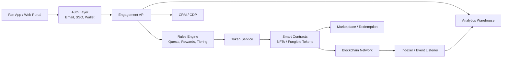

---
title: Fan Engagement Token Platform
repo: blockchain-enterprise-blueprints
primary_keyword: Tokenization
secondary_keywords:
- NFT
- Sports Tokenization
- Web3
slug: fan-engagement-token-platform
word_count_target: 1200
commit_type: 'feat(blockchain):'---

# Fan Engagement Token Platform

## Introduction

**Tokenization** is becoming a practical way for sports and entertainment organizations to turn fan loyalty into measurable digital participation. A fan engagement token platform lets teams, leagues, artists, and media brands issue digital assets that represent access, voting rights, collectibles, rewards, and community status. Unlike generic loyalty points, these assets can be programmable, transferable, and integrated into broader **Web3** ecosystems.

For founders and CTOs, the opportunity is not just about launching a token. It is about designing a platform that supports fan acquisition, retention, secondary-market activity, and new revenue streams while staying compliant and operationally reliable. The strongest implementations combine **NFT**-based collectibles, utility tokens, and analytics to create a repeatable product model.

## Problem Statement

Traditional fan engagement systems are fragmented. A team may use one system for ticketing, another for merchandise, another for email campaigns, and a separate app for community interaction. This creates several issues:

1. **Low fan portability**: Fan identity and engagement history do not move across platforms.
2. **Weak incentives**: Loyalty points often expire, cannot be traded, and have limited emotional value.
3. **Poor monetization**: Brands struggle to convert engagement into recurring revenue beyond tickets and sponsorships.
4. **Limited personalization**: Engagement data is siloed, making it hard to tailor offers or rewards.
5. **Opaque ownership**: Fans may not truly own digital collectibles or access rights.

These limitations are especially painful in sports, where superfans want status, access, and proof of participation. A **Sports Tokenization** approach can solve these gaps, but only if the architecture supports secure issuance, identity, compliance, and scalable user experiences.

## Solution

A fan engagement token platform uses **Tokenization** to issue digital fan assets tied to real utility. The platform should support three core asset types:

- **Membership tokens**: Represent access to premium communities, presales, or exclusive content.
- **NFT collectibles**: Represent moments, player cards, digital memorabilia, or event-based mementos.
- **Utility tokens**: Represent points, voting power, or rewards that can be redeemed for experiences.

A well-designed solution includes:

- **Fan identity layer**: Wallet-based or custodial identity, with optional email/social login for mainstream users.
- **Token issuance engine**: Smart contracts or managed minting services for NFTs and fungible tokens.
- **Engagement rules engine**: Logic that awards tokens for actions such as attending games, sharing content, completing quests, or purchasing merchandise.
- **Marketplace and redemption layer**: A place to trade, burn, or redeem assets for benefits.
- **Analytics and CRM integration**: Connect token activity to segmentation, retention, and campaign measurement.

The key design principle is utility first. Fans should receive assets that unlock something meaningful: early ticket access, locker-room content, voting on jersey designs, digital souvenirs, or tiered loyalty benefits. The platform should make the asset valuable because of what it does, not just because it exists.

## Architecture or Framework

A practical architecture for a fan engagement token platform should separate on-chain ownership from off-chain business logic.

### Recommended framework components

**1. Identity and onboarding**
- Use custodial wallets for mainstream fan onboarding.
- Add non-custodial wallet support for advanced users.
- Support account abstraction or gas sponsorship to reduce friction.

**2. Token contracts**
- Use ERC-721 or ERC-1155 for **NFT** collectibles.
- Use ERC-20 or similar fungible standards for reward points or governance-like utility.
- Add role-based minting, pausing, and supply controls.

**3. Rules engine**
- Define event triggers such as attendance, purchases, referrals, social actions, or quiz completion.
- Map triggers to rewards with caps to avoid abuse.
- Store campaign logic off-chain so business teams can update rules without redeploying contracts.

**4. Data and analytics**
- Use an indexer to capture transfers, mints, burns, and redemptions.
- Send token events to a warehouse for cohort analysis.
- Track metrics such as activation rate, repeat engagement, redemption rate, and secondary-market volume.

**5. Compliance and controls**
- Implement KYC/AML where token economics or jurisdiction require it.
- Add geofencing for restricted offers.
- Keep immutable records of consent and terms acceptance.

### Design trade-offs

- **Custodial vs non-custodial wallets**: Custodial improves adoption; non-custodial improves user control.
- **Public chain vs permissioned chain**: Public chains improve transparency and composability; permissioned chains can simplify compliance and cost predictability.
- **On-chain logic vs off-chain rules**: On-chain logic increases trust; off-chain logic improves flexibility and speed.

For most enterprise deployments, the best pattern is hybrid: keep ownership and transfer on-chain, while keeping campaign rules, identity, and analytics off-chain.

## Benefits

A fan engagement token platform can create measurable business value when implemented with clear utility and strong operations.

### Higher fan retention
Tokens create a reason for fans to return regularly. If a fan needs to complete quests, collect drops, or maintain status tiers, engagement becomes habitual rather than occasional.

### New monetization channels
Brands can monetize through:
- Primary sales of premium **NFT** collectibles
- Token-gated memberships
- Sponsored quests and branded drops
- Secondary-market royalties where allowed
- Paid upgrades for access or experiences

### Better segmentation
**Tokenization** gives marketers a behavioral signal. A fan who holds a rare collectible, completes weekly quests, and redeems VIP perks is a high-value segment. This improves campaign targeting and reduces wasted spend.

### Stronger community identity
Fans value status, exclusivity, and belonging. Digital assets can represent membership in a community, creating visible proof of participation and loyalty.

### Interoperability
With **Web3**, assets can move beyond a single app. A tokenized ticket stub, collectible, or badge can be used across partner ecosystems, marketplaces, and fan communities.

### Improved measurement
Unlike traditional loyalty systems, token platforms can measure issuance, transfer, redemption, and retention in near real time. This enables clearer ROI reporting for sponsors and internal stakeholders.

## Challenges

Enterprise fan token systems face real implementation risks.

### Regulatory uncertainty
Depending on structure, tokens may be treated as securities, stored value, or promotional rewards. Legal review is required before launch, especially if tokens have transferability or profit expectation.

### Fan onboarding friction
Wallet setup, seed phrases, and gas fees can reduce conversion. This is why embedded wallets, fiat payment rails, and gas abstraction are critical.

### Abuse and fraud
Quest systems can be gamed through bots, duplicate accounts, or coordinated farming. Controls should include rate limits, device fingerprinting, proof-of-attendance mechanisms, and anomaly detection.

### Brand risk
If token utility is unclear, fans may perceive the program as speculative or extractive. The product must deliver real benefits from day one.

### Operational complexity
Token issuance, metadata management, marketplace moderation, and support workflows require cross-functional coordination between engineering, legal, marketing, and customer support.

### Scalability and cost
High-volume minting events, such as match-day drops or major campaign launches, can create network congestion and fee spikes. Teams should test batch minting, layer-2 networks, and queue-based processing.

## Future Opportunities

The next generation of fan engagement token platforms will likely expand in four directions.

### Dynamic NFTs
NFT metadata can evolve based on fan behavior, season performance, or milestone completion. This enables collectibles that reflect live engagement rather than static artwork.

### Cross-brand loyalty networks
Teams, sponsors, venues, and broadcasters can share a common token layer. A fan could earn rewards at the stadium, in a streaming app, and through sponsor activations, all under one identity.

### AI-driven personalization
Token activity can feed recommendation systems that personalize offers, quests, and content. Fans who collect specific player assets or attend certain events can receive tailored campaigns.

### Programmable access and experiences
Tokens can unlock real-world benefits such as meet-and-greets, ticket upgrades, backstage access, or exclusive content windows. As infrastructure matures, **Sports Tokenization** can support more precise and automated fan experiences.

### On-chain reputation
Over time, token history can become a portable reputation layer. Fans who consistently participate, redeem, and contribute may receive higher trust scores, better access, or priority treatment.

## Conclusion

A fan engagement token platform is most effective when **Tokenization** is used to create genuine utility, not just digital novelty. The winning architecture combines identity, rules, token contracts, analytics, and compliance into a hybrid system that is easy for fans to use and flexible for business teams to manage.

For founders and CTOs, the strategic question is not whether to use **NFT**s or tokens, but how to design a platform that ties digital ownership to measurable engagement and revenue. When executed well, a fan token platform can improve retention, unlock new monetization, and create a durable community layer powered by **Web3**.

## Related Reading

- (pending)