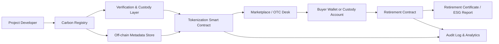

---
title: Carbon Credit Tokenization
repo: blockchain-enterprise-blueprints
primary_keyword: Tokenization
secondary_keywords:
- Blockchain
- Digital Assets
- Enterprise Blockchain
slug: carbon-credit-tokenization
word_count_target: 1200
commit_type: 'feat(blockchain):'---

# Carbon Credit Tokenization: Enterprise Architecture for Digital Environmental Assets

## Introduction

Carbon credit tokenization is becoming a practical path for turning verified environmental impact into tradable **digital assets**. For founders and CTOs building climate finance platforms, the core challenge is not simply minting tokens. It is designing a trustworthy **Tokenization** system that preserves the integrity of the underlying carbon credit, supports auditability, and integrates with enterprise controls.

In an enterprise setting, carbon credit tokenization sits at the intersection of **Blockchain**, registry operations, compliance workflows, and market infrastructure. The goal is to create a system where each token represents a specific, verifiable carbon credit or a fractional claim on a credit bundle, while preventing double counting and maintaining retirement traceability.

## Problem Statement

Carbon markets are fragmented across registries, brokers, project developers, and corporate buyers. Most carbon credit processes still rely on manual reconciliation, delayed settlement, and opaque ownership records. These issues create three major problems:

1. **Double issuance or double counting risk**  
   If credits are mirrored across systems without strict controls, the same environmental claim can be represented more than once.

2. **Low liquidity and slow settlement**  
   Traditional transfer workflows can take days or weeks, which limits market participation and increases operational cost.

3. **Weak auditability for buyers and regulators**  
   Enterprises need a clear chain of custody from issuance to transfer to retirement. Without it, claims become difficult to verify.

For enterprise blockchain teams, the challenge is to design a **Tokenization** layer that maps off-chain registry truth to on-chain state without weakening legal enforceability or compliance.

## Solution

A robust carbon credit tokenization solution combines off-chain registry validation with on-chain asset lifecycle management. The blockchain should not replace the registry; it should act as a trusted transaction and provenance layer.

The recommended approach is:

- **Verify the underlying credit off-chain** against a recognized registry or project database.
- **Lock or custody the credit** in the registry before minting the token.
- **Mint a digital representation** on-chain with metadata tied to the source credit.
- **Track transfers and retirements** through smart contracts and event logs.
- **Synchronize status changes** back to the registry or enterprise ledger.

This model supports enterprise use cases such as voluntary carbon markets, ESG reporting platforms, supply chain offset programs, and institutional trading desks.

Key design principles:

- Treat each token as a controlled digital representation, not a free-floating claim.
- Use immutable identifiers for project ID, vintage, methodology, and registry serial number.
- Implement role-based permissions for issuers, auditors, custodians, and retirement agents.
- Support both full-credit tokens and fractionalized units where market rules allow it.

## Architecture or Framework

A practical **Enterprise Blockchain** architecture for carbon credit tokenization should separate trust domains and keep registry authority distinct from market operations.

### Core components

**1. Registry integration layer**  
This layer validates project data, serial numbers, vintage, and ownership status. It should support API-based reconciliation with registries such as Verra-like or Gold Standard-like systems, depending on business partnerships.

**2. Custody and locking service**  
Before minting, the underlying credit should be locked, escrowed, or otherwise marked as unavailable for parallel sale. This prevents duplicate representation.

**3. Smart contract token standard**  
For enterprise use, ERC-721 works well for unique serial-level credits, while ERC-1155 is better for batchable or fractionalized environmental assets. The token standard should include:
- Mint
- Transfer
- Freeze
- Burn/Retire
- Metadata update with strict governance

**4. Metadata and provenance store**  
Store the minimal necessary data on-chain and keep detailed documents off-chain in a tamper-evident repository. Link them via content hashes and signed references.

**5. Retirement workflow**  
Retirement should be irreversible and generate a certificate containing token ID, retirement date, beneficiary, purpose, and associated emissions claim.

### Operational controls

A strong framework also requires:
- Multi-signature approvals for minting and retirement
- KYC/AML checks for marketplace participants
- Exception handling for registry mismatches
- Reconciliation jobs that compare on-chain supply with registry supply
- Monitoring for abnormal transfer patterns

### Metrics to track

To measure whether the architecture is working, track:
- Registry reconciliation accuracy
- Time from validation to mint
- Settlement latency
- Retirement confirmation time
- Percentage of credits with complete provenance
- Exception rate per 1,000 transactions

## Benefits

Carbon credit tokenization offers several enterprise benefits when implemented with disciplined controls.

**Improved market liquidity**  
Tokens can settle faster than manual registry transfers, allowing more participants to trade credits efficiently.

**Better provenance**  
Each movement of the asset is recorded in a tamper-resistant ledger, improving traceability for auditors and buyers.

**Fractional access to markets**  
Smaller buyers can participate through partial exposure to high-quality credits, depending on market and regulatory rules.

**Automation of lifecycle events**  
Smart contracts can automate transfer restrictions, retirement, and reporting, reducing manual overhead.

**Stronger ESG reporting**  
Organizations can link retired tokens to sustainability reports with a clear chain of custody and supporting evidence.

For founders, this creates a foundation for new products: carbon marketplaces, treasury tools, offset subscriptions, and enterprise reporting dashboards. For CTOs, it creates a reusable pattern for other **Digital Assets** such as renewable energy certificates and biodiversity credits.

## Challenges

Despite its promise, carbon credit tokenization has significant implementation risks.

**Registry alignment**  
The on-chain token must always reflect the registry status. If registry APIs are delayed or inconsistent, token supply can diverge from real-world availability.

**Legal and accounting treatment**  
A token is not automatically equivalent to a legal carbon claim. Counsel must determine how ownership, retirement, and beneficial interest are represented.

**Quality variability**  
Not all credits are equal. Tokenization does not solve project quality issues, additionality concerns, or permanence risks. Poor-quality credits can still damage platform credibility.

**Interoperability**  
Different registries, custody providers, and enterprise systems may use incompatible identifiers and workflows. Standardization is still evolving.

**Compliance overhead**  
KYC/AML, sanctions screening, tax reporting, and cross-border rules can complicate marketplace design, especially for institutional buyers.

A successful implementation therefore needs governance, legal review, and operational discipline, not just smart contracts.

## Future Opportunities

The next phase of carbon credit tokenization will likely focus on higher assurance and better interoperability.

**Programmable retirement**  
Enterprises may retire tokens automatically when emissions thresholds are met, with rules tied to procurement contracts or sustainability milestones.

**Cross-chain settlement**  
As institutional adoption grows, tokenized carbon assets may move across permissioned and public networks through controlled bridges or interoperability layers.

**AI-assisted verification**  
Machine learning can help detect anomalous project data, duplicate serial numbers, or suspicious trading patterns, improving risk controls.

**Composability with broader ESG systems**  
Tokenized carbon assets can integrate with supply chain platforms, finance systems, and sustainability reporting tools to create end-to-end environmental accounting.

**Institutional-grade standards**  
Expect stronger industry standards around metadata schemas, custody proofs, and retirement certificates. The winners will be platforms that combine technical rigor with market trust.

## Conclusion

Carbon credit tokenization is most effective when designed as an enterprise-grade **Tokenization** framework, not a simple NFT project. The winning architecture connects registry truth, custody controls, smart contract lifecycle management, and auditable retirement workflows.

For technology leaders, the priority is to build a system that protects the integrity of **Blockchain** records while preserving the legal and operational realities of carbon markets. For product teams, the opportunity is to create trustworthy **Digital Assets** that unlock faster settlement, better transparency, and new market participation models. For enterprise architects, the best approach is a controlled **Enterprise Blockchain** design with explicit governance, reconciliation, and compliance boundaries.

If implemented carefully, carbon credit tokenization can become a durable infrastructure layer for climate finance rather than a speculative wrapper around environmental claims.

## Related Reading

- (pending)