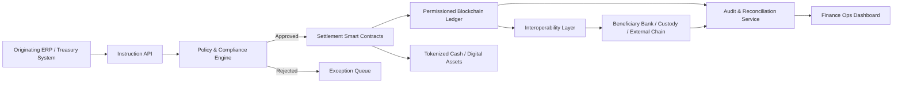

---
title: Cross-Border Settlement Layer
repo: blockchain-enterprise-blueprints
primary_keyword: Blockchain
secondary_keywords:
- Enterprise Blockchain
- Digital Assets
- Smart Contracts
slug: cross-border-settlement-layer
word_count_target: 1200
commit_type: 'feat(blockchain):'---

# Cross-Border Settlement Layer for Enterprise Blockchain Systems

## Introduction

A cross-border settlement layer built on **Blockchain** gives enterprises a programmable way to move value between jurisdictions with fewer intermediaries, faster finality, and better auditability. For banks, payment processors, trade finance teams, and tokenization platforms, the goal is not simply to “put payments on chain.” The goal is to reduce reconciliation overhead, shorten settlement cycles, and support compliant movement of **Digital Assets** across multiple ledgers and currencies.

In an enterprise setting, a cross-border settlement layer must coordinate identity, compliance, liquidity, messaging, and final settlement. That requires more than a public chain wallet transfer. It requires a controlled architecture that can integrate with existing core banking systems, foreign exchange engines, and custody providers while still using **Smart Contracts** to automate rules and reduce operational risk.

## Problem Statement

Cross-border settlement is still expensive and operationally fragmented. Traditional rails often rely on correspondent banking, batch processing, and multiple reconciliation points. This creates several issues:

- Settlement can take one to three business days or longer.
- Fees accumulate across intermediaries, FX spreads, and manual exceptions.
- Each participant maintains its own ledger, creating reconciliation gaps.
- Compliance checks are duplicated across institutions and jurisdictions.
- Liquidity must be prefunded in multiple accounts, increasing capital inefficiency.

For **Enterprise Blockchain** initiatives, these problems are especially visible when tokenized cash, stablecoins, or on-chain deposits need to move between entities in different regions. Without a settlement layer, organizations end up with isolated pilots that cannot scale beyond a narrow use case. The absence of standardized message formats, on-chain/off-chain synchronization, and policy enforcement also makes it hard to prove that a transfer is both legally valid and operationally final.

## Solution

A cross-border settlement layer uses **Blockchain** as the coordination and settlement substrate, while preserving enterprise controls around identity, permissions, and compliance. The solution should support three core functions:

1. **Instruction orchestration**  
   Payment instructions are validated, enriched with compliance metadata, and routed to the correct settlement path.

2. **Atomic or near-atomic value transfer**  
   Funds or tokenized claims move between parties with clear finality rules, ideally using escrow, delivery-versus-payment, or payment-versus-payment patterns.

3. **Audit and reconciliation**  
   Every state transition is recorded immutably so finance, treasury, and audit teams can reconcile across systems.

A practical implementation usually combines permissioned ledger infrastructure, tokenized deposits or stablecoins, and interoperable messaging. **Smart Contracts** enforce transfer conditions such as beneficiary eligibility, sanction screening status, transaction limits, and release conditions tied to external events.

Recommended design principles:

- Use a permissioned network for enterprise governance.
- Separate message validation from asset transfer.
- Keep FX logic deterministic and externally sourced.
- Design for reversible operational exceptions, not reversible settlement.
- Expose APIs for treasury, compliance, and ERP integration.

## Architecture or Framework

A robust cross-border settlement layer can be organized into five components:

1. **Participant and identity layer**  
   Maps legal entities, wallets, accounts, and roles. Integrates with KYC/KYB, sanctions screening, and entitlement systems.

2. **Instruction and policy engine**  
   Validates payment requests, checks limits, applies routing rules, and determines whether the transfer can proceed.

3. **Settlement ledger**  
   Maintains token balances, escrow states, and finality records on the **Blockchain** network.

4. **Interoperability and messaging layer**  
   Connects to SWIFT-like messages, ISO 20022 payloads, bank APIs, custody systems, and external chains.

5. **Monitoring and reconciliation layer**  
   Tracks latency, exception rates, ledger consistency, and operational SLAs.

### Implementation pattern

A practical framework for **Enterprise Blockchain** settlement is:

- **Pre-settlement**
  - Validate sender and recipient identity.
  - Confirm sanctions and travel-rule checks.
  - Reserve liquidity or collateral.
  - Lock exchange rates for a short window.

- **Settlement**
  - Execute a **Smart Contract** that moves tokenized value into escrow.
  - Release funds when both legs of the transaction are confirmed.
  - Record finality event and reference IDs on-chain.

- **Post-settlement**
  - Push events to ERP, treasury, and reporting systems.
  - Reconcile against internal ledgers and external bank statements.
  - Escalate failed or stale transactions into an exception workflow.

### Operational metrics to track

- Settlement finality time: target under 5 minutes for internal network transfers.
- Straight-through processing rate: target above 90%.
- Exception rate: target below 2% after stabilization.
- Reconciliation break rate: target below 0.5%.
- Liquidity utilization: measure prefunding reduction versus legacy rails.

## Benefits

A well-designed cross-border settlement layer delivers measurable business value:

- **Faster settlement**  
  Moves from T+1/T+2 cycles toward near-real-time transfer and confirmation.

- **Lower operational cost**  
  Reduces manual reconciliation, exception handling, and intermediary fees.

- **Improved transparency**  
  Every transfer has a consistent audit trail across participants.

- **Better liquidity management**  
  Enterprises can reduce prefunded balances by using tokenized settlement windows and just-in-time liquidity.

- **Programmable controls**  
  **Smart Contracts** can enforce policy, release logic, and conditional payment rules.

- **Broader asset support**  
  The same settlement rail can support fiat-backed tokens, stablecoins, and other **Digital Assets**.

For leadership teams, the strategic advantage is not only speed. It is control. A single settlement layer can standardize how global subsidiaries, partners, and custodians interact without forcing every counterpart to adopt the same back-office stack.

## Challenges

Despite the benefits, production deployment has real constraints:

- **Regulatory fragmentation**  
  Cross-border transfers must satisfy different AML, sanctions, data residency, and licensing requirements in each jurisdiction.

- **Interoperability complexity**  
  A network may need to connect permissioned ledgers, public chains, bank APIs, and legacy payment systems simultaneously.

- **Liquidity and FX risk**  
  Tokenized settlement still requires reliable FX sourcing, spread management, and collateral controls.

- **Privacy vs. auditability**  
  Enterprises need selective disclosure, not full public transparency. This often requires private channels, encryption, or zero-knowledge techniques.

- **Finality assumptions**  
  Different chains and custodians have different notions of finality, which can create operational ambiguity.

- **Integration debt**  
  The hardest work is often not the chain itself but ERP, treasury, and compliance integration.

Mitigation strategies include using a permissioned governance model, clear legal agreements for finality, standardized message schemas, and a staged rollout beginning with internal transfers or controlled corridors.

## Future Opportunities

The next phase of **Blockchain**-based settlement will likely focus on interoperability and composability. Several opportunities stand out:

- **Tokenized deposits and bank money**  
  As regulated institutions issue on-chain liabilities, settlement can become more native to banking infrastructure.

- **Cross-chain settlement orchestration**  
  Bridges and interoperability protocols will let enterprises route value across multiple ledgers while preserving policy controls.

- **Programmable compliance**  
  **Smart Contracts** can encode jurisdiction-specific rules, travel-rule checks, and transaction thresholds dynamically.

- **Real-time treasury optimization**  
  Settlement data can feed forecasting models that optimize liquidity, hedging, and corridor selection.

- **Integration with trade finance**  
  Cross-border payment and document workflows can converge, reducing duplication between invoice, shipment, and payment events.

- **Institutional digital asset rails**  
  The same framework can support securities settlement, tokenized funds, and collateral mobility across markets.

For leaders building long-term infrastructure, the opportunity is to treat settlement as a shared platform capability rather than a product feature. That shift turns isolated pilot projects into reusable enterprise infrastructure.

## Conclusion

A cross-border settlement layer built on **Blockchain** is most effective when it combines programmable settlement, compliance automation, and enterprise-grade integration. The architecture should not try to replace every legacy system at once. Instead, it should provide a controlled bridge between existing payment operations and new **Digital Assets** workflows.

For founders and CTOs, the winning approach is to define a narrow corridor, measure finality and reconciliation outcomes, and expand only after proving reliability. With the right governance, **Enterprise Blockchain** can reduce settlement friction, and **Smart Contracts** can make cross-border transfers more deterministic, auditable, and scalable.

## Related Reading

- (pending)