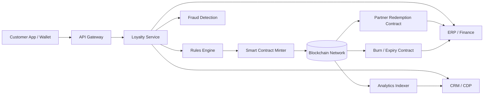

---
title: Loyalty Points to On-Chain Assets
repo: blockchain-enterprise-blueprints
primary_keyword: Digital Assets
secondary_keywords:
- Tokenization
- Web3
- Blockchain
slug: loyalty-points-to-on-chain-assets
word_count_target: 1200
commit_type: 'feat(blockchain):'---

# Digital Assets: Loyalty Points to On-Chain Assets

## Introduction

Loyalty points are one of the most common forms of **Digital Assets** in enterprise ecosystems, even when they are not yet treated that way in architecture or finance. Airlines, retail brands, hospitality groups, and fintech platforms already manage balances that have value, transfer rules, and redemption logic. The next step is to make those balances portable, programmable, and auditable through **Tokenization** on **Blockchain** infrastructure.

For founders and CTOs, the business case is straightforward: loyalty points are often fragmented across systems, hard to exchange, and expensive to reconcile. Moving them into a **Web3**-enabled model creates a path toward interoperability, partner networks, and more flexible customer engagement. But the move is not just a technical migration. It changes custody, accounting, compliance, and customer experience.

This article outlines how to convert loyalty points into on-chain assets without losing enterprise controls.

## Problem Statement

Traditional loyalty programs suffer from several structural issues:

1. **Closed-loop design**: Points often exist only inside one brand’s database, which limits utility and reduces customer perceived value.
2. **Poor interoperability**: Partner redemption requires custom integrations, manual settlement, or bilateral agreements.
3. **Reconciliation overhead**: Finance teams must match point issuance, breakage, redemptions, and expirations across multiple systems.
4. **Limited programmability**: Rules such as vesting, tier-based multipliers, or cross-brand swaps are difficult to enforce consistently.
5. **Fraud and duplication risk**: Centralized ledgers can be manipulated through API abuse, duplicate issuance, or internal control gaps.

These problems become more visible as enterprises expand into marketplaces, super-apps, and multi-brand ecosystems. Loyalty points are effectively a liability on the balance sheet, yet they are treated like a siloed marketing feature. Reframing them as **Digital Assets** allows teams to build around asset lifecycle management instead of ad hoc point logic.

## Solution

The solution is to represent loyalty points as on-chain assets with clear issuance, transfer, redemption, and burn rules. This does not mean every customer interaction must happen directly on a public chain. In most enterprise deployments, a hybrid approach works best:

- Keep customer identity and KYC data off-chain.
- Mint loyalty assets on a permissioned or public chain depending on regulatory and partner requirements.
- Use smart contracts to encode supply rules, redemption permissions, and expiration policies.
- Maintain an off-chain event bus for customer notifications, ERP sync, and analytics.

A practical implementation usually includes three layers:

- **Business layer**: Defines point economics, earn/burn ratios, partner settlement rules, and fraud controls.
- **Token layer**: Implements the asset standard, transfer restrictions, and supply accounting.
- **Integration layer**: Connects CRM, POS, mobile apps, finance systems, and partner APIs.

For example, a retail coalition can issue one on-chain unit for every 100 loyalty points. Customers can redeem directly with the issuer or swap with partners in a controlled marketplace. The chain becomes the source of truth for asset movement, while enterprise systems remain the source of truth for identity and customer service.

## Architecture or Framework

A reference architecture for converting loyalty points to on-chain **Digital Assets** should separate custody, compliance, and settlement concerns.

### Framework components

**1. Identity and wallet model**  
Use custodial wallets for mainstream consumers and non-custodial wallets for advanced users or partner ecosystems. Map customer IDs to wallet addresses through a secure identity service. Avoid storing personally identifiable information on-chain.

**2. Smart contract design**  
Choose a token standard based on the asset model:

- **Fungible token** model for interchangeable points.
- **Semi-fungible token** model for tiered or campaign-specific rewards.
- **Non-fungible token** model only if each reward has unique entitlement or provenance.

For most loyalty programs, fungible tokens are enough. Add contract modules for minting limits, transfers, pauses, blacklists, and expiration.

**3. Settlement and accounting**  
Every mint, transfer, or burn event should emit an indexed event consumed by finance and analytics systems. This enables reserve tracking, liability reporting, and breakage estimation. Reconcile token supply against the loyalty liability ledger daily.

**4. Compliance controls**  
Implement KYC/AML checks where points can be converted to cash-like value or exchanged externally. Add jurisdiction rules to prevent prohibited transfers. If points have monetary characteristics, involve legal and tax teams early.

**5. Operational monitoring**  
Track metrics such as mint latency, redemption success rate, contract revert rate, and ledger reconciliation variance. These metrics help determine whether the on-chain model is improving control or simply adding complexity.

## Benefits

Tokenizing loyalty points as **Digital Assets** creates measurable advantages:

- **Interoperability**: Partners can redeem or accept points without bespoke database integrations.
- **Programmability**: Smart contracts can enforce expiry, tier bonuses, and promotional windows automatically.
- **Transparency**: Customers and auditors can verify balances and movement history.
- **Faster settlement**: Redemption between partners can be settled near real time instead of through monthly batch files.
- **Reduced reconciliation effort**: On-chain events provide a single audit trail for issuance and burn activity.
- **New business models**: Brands can create secondary markets, coalition programs, or asset-backed perks.

A strong enterprise benefit is improved trust. When loyalty balances are visible and rules are explicit, customers are less likely to question missing points or delayed redemptions. Internally, product and finance teams gain a shared ledger that reduces ambiguity.

## Challenges

Despite the promise, moving loyalty points to **Blockchain** infrastructure introduces real trade-offs.

**Regulatory classification**  
Depending on redemption rights and transferability, tokenized points may be treated as stored value, e-money, or a taxable benefit. The legal classification changes reporting obligations and platform design.

**Customer experience complexity**  
Wallets, gas fees, seed phrases, and chain confirmations can confuse mainstream users. Abstracting these details behind a familiar app interface is often necessary.

**Privacy and data protection**  
Blockchain records are difficult to delete. That conflicts with privacy obligations if customer data is exposed on-chain. Use hashed references, off-chain storage, and selective disclosure patterns.

**Scalability and cost**  
High-volume loyalty programs can generate large transaction counts. Public chains may introduce variable fees and confirmation delays. Layer 2 networks or permissioned chains can reduce cost, but they add operational complexity.

**Governance**  
Who can mint, burn, pause, or upgrade the contract? Governance must be explicit, audited, and separated by role. A weak admin model can create fraud risk or accidental supply inflation.

## Future Opportunities

The shift from loyalty points to on-chain assets opens several strategic opportunities for enterprises:

- **Cross-brand asset exchange**: Customers could swap points across airlines, hotels, retailers, and marketplaces using standardized rules.
- **Composable rewards**: Loyalty assets can be bundled with tickets, memberships, event access, or digital collectibles.
- **Dynamic pricing and incentives**: Reward rates can adjust based on demand, inventory, or customer lifetime value.
- **Programmable partner settlement**: Brands can automate revenue share and redemption clearing through smart contracts.
- **Asset-backed memberships**: Loyalty points can evolve into broader membership tokens with access rights and perks.
- **Interoperable ecosystems**: A shared **Web3** layer can let enterprises connect without rebuilding point systems from scratch.

The long-term opportunity is not just better loyalty. It is a reusable asset infrastructure for digital commerce. Once enterprises adopt a common **Tokenization** framework, they can extend the same architecture to gift cards, vouchers, subscriptions, and other **Digital Assets**.

## Conclusion

Converting loyalty points into on-chain assets is a practical enterprise use case, not a speculative experiment. The right architecture balances customer usability, compliance, and operational control while giving brands a more transparent and programmable asset model. For leaders building modern rewards platforms, **Digital Assets** provide a cleaner foundation than legacy point databases.

The best implementations start small: one program, one token standard, one redemption path, and one reconciliation workflow. From there, enterprises can expand into partner networks and broader **Blockchain**-enabled ecosystems without sacrificing governance.

## Related Reading

- (pending)